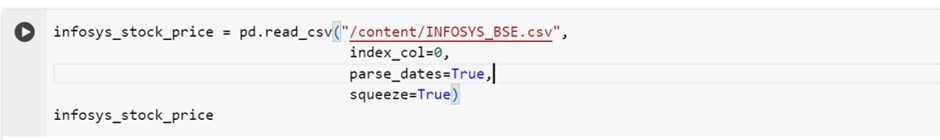

# Infosys Stock Price Prediction

The purpose of this project is to create a prediction model to predict the stock prices for Infosys.
- Build a model to predict the price for the said period by splitting the data into train and test set.
- Find trends in short term and long term.
- Impact of external factors or any events.

## Mentors

- Ms. Aishwarya Mate

## Team

- Clive Dominic Andrews
- Yash Kalose
- Pranav Bandu Ranpise
- Vaishnavi Mayur Gaikwad
- Babasaheb Anil Gade
- Sagar Narayan Panchbudhe
- Prachi Niraj Sarve

## Data Set

- We collected data from Yahoo Finance.com.Then download Infosys_BSE.csv file & took duration from 2000-2023 years
- Before training our ARIMA model, we need to preprocess and prepare the stock market data through EDA and various transformation.

## Project Work FlowPIs
    1. Data Preprocessing
    2. Data Splitting into Test and Train Data
    3. Feature selection for Training Data to create a Training Model
    4. Prediction based on Training Data and then Test Data
    5. Performance Measure.
    6. Deployment

## EDA (Exploratory Data Analysis)
 - Reading the data from Yahoo Finance.com that was downloaded as Infosys_BSE.csv file & took duration from 2000-2023 years
  
 (images/p1StPr_eda2.jpg)

 
 - Data is checked , and there is no null value present in the dataset .  Also, we got to know the datatype of the columns
 (images/p1StPr_eda3.jpg)

 - We performed all the statistics , we got to know the main values of  mean, standard deviation , min-max.
  (images/p1StPr_eda4.jpg)

 - Dropping columns not needed
 (images/p1StPr_eda5.jpg)

 - Checking missing values
 - Checking for duplicates
 (images/p1StPr_eda6.jpg)

 - Renaming columns
 (images/p1StPr_eda7.jpg)

 - Converting DATE column to index
 (images/p1StPr_eda8.jpg)
 (images/p1StPr_eda9.jpg)

## Visualization

(images/p1StPr_eda10.jpg)
(images/p1StPr_eda11.jpg)
(images/p1StPr_eda12.jpg)
(images/p1StPr_eda13.jpg)
(images/p1StPr_eda14.jpg)
(images/p1StPr_eda15.jpg)
(images/p1StPr_eda16.jpg)
(images/p1StPr_eda17.jpg)
(images/p1StPr_eda18.jpg)
(images/p1StPr_eda19.jpg)
(images/p1StPr_eda20.jpg)
(images/p1StPr_eda21.jpg)
(images/p1StPr_eda22.jpg)
(images/p1StPr_eda23.jpg)
(images/p1StPr_eda24.jpg)
(images/p1StPr_eda25.jpg)
(images/p1StPr_eda26.jpg)
(images/p1StPr_eda27.jpg)
(images/p1StPr_eda28.jpg)
(images/p1StPr_eda29.jpg)
(images/p1StPr_eda30.jpg)
(images/p1StPr_eda31.jpg)
(images/p1StPr_eda32.jpg)
(images/p1StPr_eda33.jpg)
(images/p1StPr_eda34.jpg)
(images/p1StPr_eda35.jpg)

 

#### KPI 1:
    We have noticed that the payments are higher on weekdays when compared to Weekend

#### KPI 2:
    - The number of orders with review score 5 and payment type as credit card are 44.33K.
    - We have observed that Boleto is the second most popular method of payment where it is a prepaid payment method which is used for online payment.
    - We also see that the number of installments are increasing the percentage of payment
    - values are reducing suggesting that most people prefer to pay either upfront or with lesser installment duration rather than higher.
    - We see that 10 month installments are high, which could be due to some offer that was in place.

#### KPI 3:
    The average number of days taken for order delivered customer date for pet_shop is 11 days

#### KPI 4:
    The average price and payment values from customers of sao paulo city are $152.77 and $108.33 respectively.

#### KPI 5:
    - There is an inverse relationship between the shipping days and the review scores i.e., Customers are satisfied when the delivery time is reduced.
    - The highest average review score of 5 was seen when the delivery days is the least ~10 days and so on.
    - The lowest average review score of 1 was seen when the delivery days was 21.

## Suggestions

#### KPI 1:
    1. We have noticed that the payments are higher on weekdays when compared to Weekend, where there is a lot of scope but not exploited. People are free on weekends and can be lured to visit the physical stores on weekends by having more promotional offers (sales, discount vouchers, etc) on the weekend, when more customers are free to avail the offers and employ more staff to handle the crowd.
    2. When checking the payment type we see that the vouchers have less volume and there is scope to expoit this option.

#### KPI 2:
    1. Limit the installment duration to avail maximum sale. We can have similar offer suggested for 3 months duration so that more number of people will avail this offer
    2. This will ensure that customers wanting to purchase products are being compelled to purchase but not withstanding due to lack of funds, not made easier by the installment options.
    3. Also, giving offers such as interest free installments and/or no processing fees to ensure that purchase is completed.
    4. Keep special offers for using Boleto in physical stores on weekends and online stores on weekdays, when they are busy working and cannot go physically to the store.

#### KPI 3:
    1. Target to reduce the shipping days
        - Segregate the top moving products
        - Prioritize the products according to the customer history

#### KPI 4:
    1. Sao Paulo city customers buy low price products
    2. To achieve highest sale
        - Top products stocked adequately
        - Offer as buy1-get1 for more sale
        - Reviews from the seller                    

#### KPI 5:
    1. The average delivery time of 11-12 is very high and should be aimed to be reduced to 1 week or lower.
    2. Keep customers happy (Customer loyalty program)
       - Providing membership (Ex: Gold)
       - Providing free shipment charges above a particular cart size or on specific days (Ex. Weekends)
       - Providing Vouchers based on sale amount
       - Discounts after reaching target
       - Gift products based on the frequent sales made
    3. Coordinating with the sellers to identify customer behaviour and stocking products most purchased and getting feedback on slow moving products, etc.
        - Clubbing slow moving product with fast moving product as offers to increase sale of slow moving products.
    4. Promting customers purchasing a specific product frequently of offers on that product to increase customer loyalty and benefit to both customer and the store.
    5. Ensuring that feedback of customers are taken at stores and review obtained in person to help better service and obtain that better review score

## Screenshots

## Excel Dashboard:

## PowerBI Dashboard:

## Tableau Dashboard:

